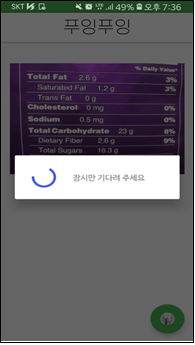

# 푸잉 푸잉 (ETRI 인공지능 OPEN API 활용 공모전)

## 프로젝트 계획이유

일반인들은 외국 제품들의 성분표를 쉽게 알지 못하는 경우가 많습니다. 또한, 성분표가 한국어로 표기되어 있더라도 생소한 이름이 많아 어떤 효과나 부작용이 있는지 알기 어렵습니다. 그래서 일반인들이 식품성분표의 사진을 찍으면 해당 사진에 있는 성분들의 이름과 내용을 제공하는 앱을 계획했습니다.

## 알고리즘

앱을 실행한 후 사용자가 성분표를 촬영하거나 갤러리에 있는 사진을 선택하면 OCR을 이용하여 사진에 있는 모든 텍스트를 추출합니다. 추출한 텍스트들을 네이버 번역 API를 이용하여 외국어를 한국어로 번역을 한 후 개체명 인식 API를 이용하여 필요한 정보의 태그(MT_CHEMICAL, TMM_DRUG, FD_MEDICINE, CV_FOOD, CV_DRINK, MT_ELEMENT, MT_METAL)가 있는 단어들을 판별하여 해당 단어들을 추출합니다. 해당 단어들은 위키백과 QA API를 이용하여 성분 및 재료에 대한 위키백과에서 정의하고 있는 자세한 정보들을 출력하여 사용자에게 제공합니다.

## 시퀀스 다이어그램

## Screenshot
### 메인화면

 
우측 하단의 플로팅 버튼을 통해 사진을 입력을 시작할 수 있습니다.
### 사진 입력 방법
  
 
사진을 입력하는 방법은 두 가지가 있으며, 카메라를 눌러 즉시 사진을 찍거나 사진첩을 눌러 로컬 저장소에 있는 사진을 불러올 수 있습니다.
### 로딩

 
입력한 사진의 데이터를 정제하는 과정이 필요합니다.
### 결과 출력

 
성분에 대한 정보를 리사이클러뷰 형태로 제공하며, 리사이클러뷰의 항목을 클릭하면 해당 항목에 대한 위키백과 상세정보를 제공한다.

## 활용 범위
### 활용 분야
어플리케이션을 통한 서비스만이 아닌 식료품점, 약국 등 식품 성분표 규격에 맞는 기기를 생산하여 아이오티를 통해 성분, 재료 정보 제공 서비스로 발전할 수 있습니다.
### 기대효과
* 사진만 찍으면 되는 간편한 사용법으로 스마트폰에 익숙하지 않은 사람도 식품 성분표에 대한 정보를 얻을 수 있으므로 식품을 구매할 때 도움이 될 수 있습니다.
* OCR 기능을 통하여 사진에서 글자를 인식하므로 작은 공간에 빽빽하게 쓰여진 작은 성분들을 쉽게 인지할 수 있습니다.
* 번역기능을 제공하여 외국어로 되어있는 성분에 대해서도 알레르기로 인한 부작용을 방지할 수 있습니다.
* 약품이나 식품의 성분에 대한 지식이 부족한 사용자들도 위키백과 QA API의 자세한 설명을 확인할 수 있습니다.

## Built With

* [이상민](링크)
* [봉대현](Link)
* [지규빈](Link)
